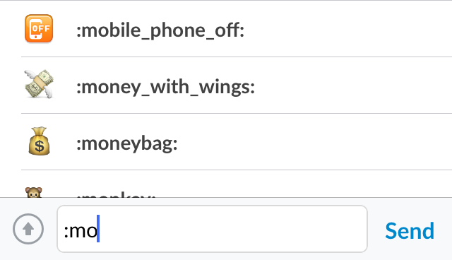

Slack Chat Kit
=============================================
[](https://cocoadocs.org/docsets/SlackChatKit)
[](http://opensource.org/licenses/MIT)

A drop-in (and non-hacky) replacement of UITableViewController & UICollectionViewController, with growing text view and many other useful chat features. SCKChatViewController has beeen designed as a template view controller to be subclassed, overriding forward methods for performing additional logic.

This library is part of Slack's iOS UI foundations, specially designed and coded to best fit its needs, while still being flexible enough to be reused by others wanting to build great chat clients for iOS.

## Features

### Core
- UITableView/UICollectionView support
- Works completly with Auto-Layout, being flexible enough to any iOS8 Size Classes
- Totally customizable by exposing left and right buttons, text view and tool bar.
- Auto-expanding text view, with lines limit support
- Auto-completion mode by registering any prefix key (@,#,/, and so on)
- Tap gesture for dissmissing text input
- Useful text appending APIs
- External keyboard support for basic commands.
- Auto-orientation support
- Localization support
- iPhone and iPad support
- iOS 7 and 8 compatible

### Optional
- Edition mode
- Typing indicator display (as user name list)
- Panning gesture for gradually dissmissing the text input and keyboard
- Shake gesture for undoing typed text
- Image pasting support
- Left accesorry button
- Inverted mode for displaying cells from bottom (using CATransform)
- bouncing effect in animations

## Installation

Available in [Cocoa Pods](http://cocoapods.org/?q=SlackChatKit)
```
pod 'SlackChatKit'
```

##How to use

###Subclassing
`SCKChatViewController` is meant to be suclassed, like you would normally do with UITableViewController or UICollectionViewController. This pattern is by far the more convinient way of extending a ViewController behaviours, managing all the magic behind the scene while you still being able to intervene with custom behaviours, overriding forwarding methods, and deciding either to call super and  perform additional logic, or not to call super and override default logic.

Start by creating a new instance sublass of `SCKChatViewController`.

In the init overriding method, if you wish to use a the `UITableView` version, call:
```
[super initWithStyle:UITableViewStylePlain]
```

or the `UICollectionView` version:
```
[super initWithCollectionViewLayout:[UICollectionViewFlowLayout new]]
```


Protocols like `UITableViewDelegate` and `UITableViewDataSource` are already setup for you. You will be able to call whathever delegate and data source methods you need for customising your control.

Calling `[super init]` will call by default `[super initWithStyle:UITableViewStylePlain]`.


###Auto-Expanding Text View


The text view expands automatically when a new line is requiered, until it reaches its `maxNumberOfLines`value. You may change this property's value in the textView.

By default, the number of lines is set to best fit each device dimensions:
- iPhone 4      (<=480pts): 4 lines
- iPhone 5/6    (>=568pts): 6 lines
- iPad          (>=768pts): 8 lines: 8 lines

On iPhone devices, in landscape orientation, the maximum number of lines is changed to 2 to best fit the limited height.

###Auto-Completion

At Slack we use auto-completion mechanism for many things such as completing user names, channel titles, emoji aliases and more. It is a great tool for users to quickly type repeated thing.



Enabling auto-completion for your application is really easy.
Just follow these simple steps:

#### 1. Registration
You must first register all the prefixes you'd like to support for auto-completion detection:
````
[self registerPrefixesForAutoCompletion:@[@"#"]];
````

#### 2. Processing
Every time a new character is inserted in the text view, the nearest word to the caret will be processed and verified if it contains any of the registered prefixes.

Once the prefix has been detected, `-canShowAutoCompletion` will be called. This is the perfect place to populate your data source, and return a BOOL if the auto-completion view should actually be shown. So you must override it in your subclass, to be able to perform additional tasks. Default returns NO.

````
- (BOOL)canShowAutoCompletion
{
    NSString *prefix = self.foundPrefix;
    NSString *word = self.foundWord;
    
    self.searchResult = [[NSArray alloc] initWithArray:self.channels];
    
    if ([prefix isEqualToString:@"#"])
    {
        if (word.length > 0) {
            self.searchResult = [self.searchResult filteredArrayUsingPredicate:[NSPredicate predicateWithFormat:@"self BEGINSWITH[c] %@ AND self !=[c] %@", word, word]];
        }
    }

    if (self.searchResult.count > 0) {
        self.searchResult = [self.searchResult sortedArrayUsingSelector:@selector(localizedCaseInsensitiveCompare:)];
    }
    
    return self.searchResult.count > 0;
}
````

The auto-completion view is a UITableView instance, so you will need to use `UITableViewDataSource` to populate its cells. You also have total freedom for customising the UITableViewCells displayed here.

You don't need to call `-reloadData`, since it will be called automatically if you return `YES` in `-canShowAutoCompletion`.

#### 3. Layout

The maximum height of the auto-completion view is set to 140 pts, but you may change the minimum height depending of the amount of cells you are going to display in this tableview.

````
- (CGFloat)heightForAutoCompletionView
{
    CGFloat cellHeight = [self.autoCompletionView.delegate tableView:self.autoCompletionView heightForRowAtIndexPath:[NSIndexPath indexPathForRow:0 inSection:0]];
    return cellHeight*self.searchResult.count;
}
````

#### 4. Confirmation

If the user selects any cells presented in the auto-completion view, calling `-tableView:didSelectRowAtIndexPath:`, you must call `-acceptAutoCompletionWithString:` passing the corresponding string matching that item, that you would be insert in the text view.

`````
- (void)tableView:(UITableView *)tableView didSelectRowAtIndexPath:(NSIndexPath *)indexPath
{
    if ([tableView isEqual:self.autoCompletionView]) {
        
        NSString *item = self.searchResult[indexPath.row];
        
        [self acceptAutoCompletionWithString:item];
    }
}
````

The auto-completion view will automatically be dismissed, and the picked string will be inserted in the view right after the prefix string.

You can always can `-cancelAutoCompletion` for exiting the auto-completion mode.


Auto-completion has been designed to work with local data for now. It hasn't been tested with data being fetched from a remote server.

###Edition Mode


To enable the edit mode, you simply need to call `[self editText:@"hello"];`, and the text input will automatically adjust to the edition mode, removing both left and right buttons, extending the view a bit higher with a "cancel" and "accept" buttons. Both of this buttons are accessible under `SCKChatToolbar` for customisation.

To capture the events of cancelling or accepting, you must override the following methods.

````
- (void)didCommitTextEditing:(id)sender
{
    NSString *message = [self.textView.text copy];
    
    [self.messages removeObjectAtIndex:0];
    [self.messages insertObject:message atIndex:0];
    [self.tableView reloadData];
    
    [super didCommitTextEditing:sender];
}

- (void)didCancelTextEditing:(id)sender
{
    [super didCancelTextEditing:sender];
}
````

Notice there that you must call `super` at some point, so the text input exits the edition mode, re-adjusting the layout and clearing the text view.
Use the `editing` property to know if the editing mode is on.


###Typing Indicator


Additionaly, you can enable a simple typing indicator to be displayed right above the text input. It shows the name of the users that are typing, and if more than 2, it will display "Several are typing" message.

To enable the typing indicator, just call `[self.typeIndicatorView insertUsername:@"John"];` and the view will automatically be animated on top of the text input. After a default interval of 6 seconds, if the same name hasn't been assigned once more, the view will be dismissed animately.

You can remove user names from the list by calling `[self.typeIndicatorView removeUsername:@"John"];`

You can also dismiss it completly by calling `[self.typeIndicatorView dismissIndicator];`

###Panning Gesture

As part of the UI patterns for text composing in iOS, dismissing the keyboard with a panning gesture is a very practical feature. It is enabled by default with the `keyboardPanningEnabled` property. You can always disabled it if you'd like.

###Shake Gesture


Another UI pattern in text composing is the shake gesture for clearing a text view's content. This is also enabled by default with the `undoShakingEnabled` property.

You can optionally override `-willRequestUndo`, to implement your UI to ask the users if he would like to clean the text view's text. If there is not text entered, the method will not be called.

If you don't override `-willRequestUndo` and `undoShakingEnabled` is set to `YES`, a system UIAlertView will prompt.

###Inverted Mode

Some chat UI layouts may requiere that the message show from bottom to top. To enable this, you must use the `inverted` flag property. This will actually invert the UITableView/UICollectionView, so you will need to do a transform adjustment in your UITableViewDataSource method `-tableView:cellForRowAtIndexPath:` for the cells to show correctly.

````
- (UITableViewCell *)tableView:(UITableView *)tableView cellForRowAtIndexPath:(NSIndexPath *)indexPath
{
    UITableViewCell *cell = [self.tableView dequeueReusableCellWithIdentifier:chatCellIdentifier];
    
    // Cells must inherit the table view's transform
    // This is very important, since the main table view may be inverted
    cell.transform = self.tableView.transform;
}
````

###External Keyboard

There a few basic key commands enabled by default:
- return key -> calls `-didPressRightButton:` or `-didCommitTextEditing:` if in edit mode
- shift/control + return key -> line break
- escape key -> exits edit mode, or auto-completion mode, or dismisses the keyboard

To add additional key commands, simply override `-keyCommands` and append `super`'s array.

`````
- (NSArray *)keyCommands
{
    NSMutableArray *commands = [NSMutableArray arrayWithArray:[super keyCommands]];
    
    // Edit last message
    [commands addObject:[UIKeyCommand keyCommandWithInput:UIKeyInputUpArrow
                                           modifierFlags:0
                                                   action:@selector(editLastMessage:)]];
    
    return commands;
}
````

##Sample project

Take a look into the sample project, everything is there.


## License
(The MIT License)

Copyright (c) 2014 Slack Technologies, Inc. <hello@slack.com>

Permission is hereby granted, free of charge, to any person obtaining a copy of this software and associated documentation files (the 'Software'), to deal in the Software without restriction, including without limitation the rights to use, copy, modify, merge, publish, distribute, sublicense, and/or sell copies of the Software, and to permit persons to whom the Software is furnished to do so, subject to the following conditions:

The above copyright notice and this permission notice shall be included in all copies or substantial portions of the Software.

THE SOFTWARE IS PROVIDED 'AS IS', WITHOUT WARRANTY OF ANY KIND, EXPRESS OR IMPLIED, INCLUDING BUT NOT LIMITED TO THE WARRANTIES OF MERCHANTABILITY, FITNESS FOR A PARTICULAR PURPOSE AND NONINFRINGEMENT. IN NO EVENT SHALL THE AUTHORS OR COPYRIGHT HOLDERS BE LIABLE FOR ANY CLAIM, DAMAGES OR OTHER LIABILITY, WHETHER IN AN ACTION OF CONTRACT, TORT OR OTHERWISE, ARISING FROM, OUT OF OR IN CONNECTION WITH THE SOFTWARE OR THE USE OR OTHER DEALINGS IN THE SOFTWARE.
